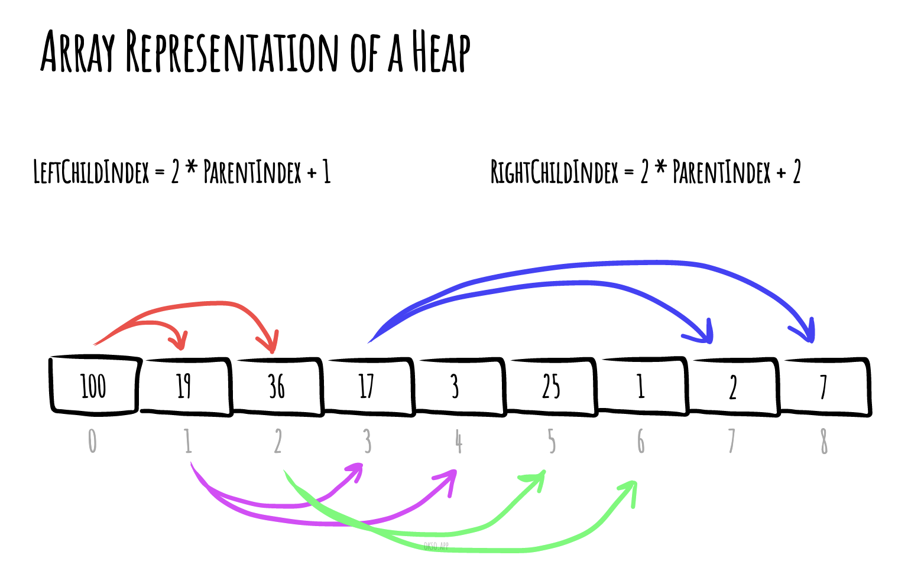
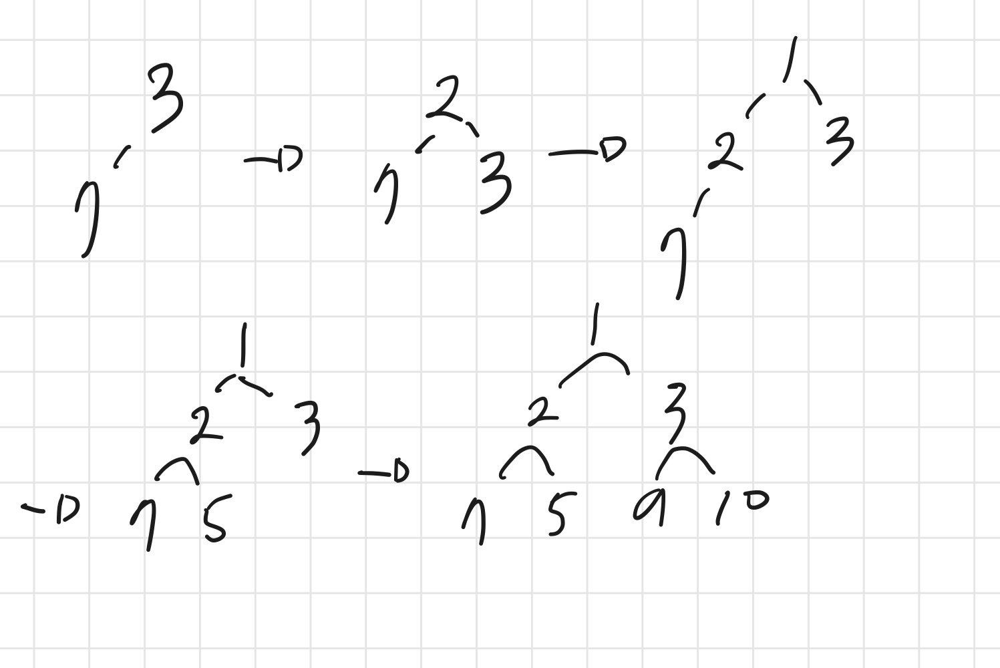
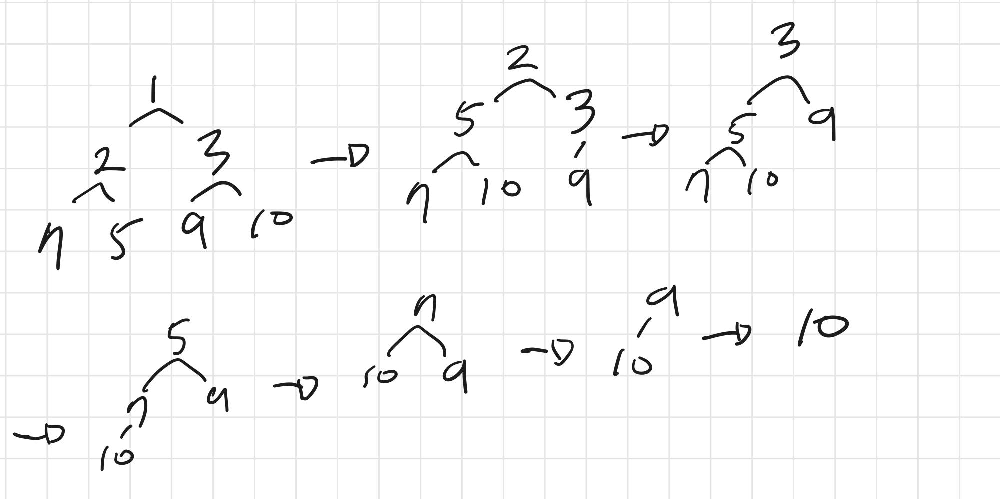

# 힙이란?

**힙(Heap)**은 우선순위 큐를 위해 고안된 완전이진트리 형태의 자료구조이다.

여러 개의 값 중 최댓값 또는 최솟값을 찾아내는 연산이 빠르다.

## 힙의 특징

- **완전이진트리** 형태로 이루어져 있다.
- 부모노드와 서브트리간 대소 관계가 성립된다. (반정렬 상태)
- 이진탐색트리(BST)와 달리 중복된 값이 허용된다.

## **힙의 종류**

- **최대 힙 (Max Heap)**
  - 부모 노드의 키 값이 자식 노드보다 크거나 같은 완전이진트리이다.
  - `key(부모노드) ≥ key(자식노드)`
- **최소 힙 (Min Heap)**
  - 부모 노드의 키 값이 자식 노드보다 작거나 같은 완전이진트리이다.
  - `key(부모노드) ≥ key(자식노드)`

## 힙의 표현

힙은 완전 이진트리입니다. 힙은 일반적으로 배열로 표현한다.

루트 노드의 인덱스 i가 1인 경우 다음과 같은 속성이 있다.

- 노드 i의 부모노드 인덱스 : ⌊i/2⌋
- 노드 i의 왼쪽 자식 노드 인덱스 : 2\*i + 1
- 노드 i의 오른쪽 자식 노드 인덱스 : 2\*i + 2



# 구현

최대 힙 관련 문서작성은 생략

## 최소 힙 ADT

객체: 우선순위를 가진 요소들의 배열

메서드

- insert(x): 우선순위 큐에 요소 x추가
- poll(): 우선순위큐에서 우선순위가 가장 낮은 요소 제거 후 반환
- find(): 우선순위 큐에서 우선순위가 가장 낮은 요소 반환

특징

- 왼쪽 자식 노드의 index = 부모 노드의 index \* 2
- 오른쪽 자식 노드의 index = 부모 노드의 index \* 2 + 1
- 부모노드의 index = 자식노드의 index / 2

heapifyUp: 제일 마지막에 노드를 추가한 후 힙 속성을 유지하는 작업

- 마지막에 넣은 노드와 마지막에 넣은 노드의 부모노드를 비교
- 현재 노드의 값이 현재 노드의 부모 값보다 작으면 부모노드와 현재 노드 교체
- 힙 속성이 유지할 때까지 위의 과정 반복

시간복잡도: O(logN)

```tsx
/**
 * 마지막에 this.arr에 삽입한 노드가 제자리로 찾아갈 수 있도록 하는 함수
 */
private heapifyUp() {
  let currentIdx = this.arr.length - 1;

  // 현재 노드의 값이 현재 노드의 부모값보다 작으면 부모노드와 현재 노드를 교체
  while (this.arr[currentIdx] < this.arr[this.getParentIndex(currentIdx)]) {
    this.swap(currentIdx, this.getParentIndex(currentIdx));
    // 교체 이후 새로운 노드의 부모를 재할당
    currentIdx = this.getParentIndex(currentIdx);
  }
  return this;
}
```

heapifydown: 0번 노드를 제거 후 힙 속성을 유지하는 작업

- 최상위 요소부터 시작 (마지막 노드와 교체된 0번 노드)
- left child가 있을 때까지 검사
  - 왼쪽, 오른쪽 노드 중 작은 노드를 찾기
    - 오른쪽 노드가 있다면 현재 요소와 비교해서 더 작은 값을 찾는다.
    - 오른쪽 노드가 없다면 왼쪽 요소가 더 작은 값을 인덱스가 된다.
  - 작은 노드를 찾아서 현재 노드보다 작다면 위로 올린다.

시간복잡도: O(logN)

```tsx
/**
 * poll이후에 수정된 최상단노드가 올바른 자리로 찾아가게 하는 함수
*/
private heapifyDown() {
  let currentIdx = 0;
  const count = this.arr.length;

  // 왼쪽 요소가 있을 때까지 검사
  while (this.getLeftChildIndex(currentIdx) < count) {
    const leftChildIdx = this.getLeftChildIndex(currentIdx);
    const rightChildIdx = this.getRightChildIndex(currentIdx);

    let smallerChildIdx = this.getLeftChildIndex(currentIdx);
    // 오른쪽 자식이 없으면 왼쪽 자식을 가장 작은 노드로 사용
    // 오른쪽 자식이 있으면 왼쪽 자식과 비교해서 가장 작은 노드 수정
    if (this.arr[rightChildIdx]) {
      smallerChildIdx =
        this.arr[rightChildIdx] < this.arr[leftChildIdx] ? rightChildIdx : leftChildIdx;
    }

    // 현재 탐색하고 있는 노드의 부모 노드가 탐색하고 있는 노드보다 값이 크다면 (= 우선 순위가 낮다면) 탐색 중인 노드를 대체한다.
    if (this.arr[smallerChildIdx] <= this.arr[currentIdx]) {
      this.swap(smallerChildIdx, currentIdx);
      currentIdx = smallerChildIdx;
    } else break;
  }
  return this;
}
```

### 삽입

- 완전이진트리의 마지막 노드에 새로운 노드를 추가한다. (push)
- 추가된 새로운 노드를 부모의 노드와 비교하며 교환한다. (swap)
- 정삭적인 힙트리가 될 때까지 추가된 노드를 부모 노드와 비교하며 교환한다. (heapify up)

시간복잡도: O(log2N) - 최악의 경우 부모 노드까지 가야함

```tsx
insert(value: number) {
  return this.push(value).heapifyUp();
}
```

### 삭제

- 루트 노드를 제거한 후 반환한다.
- 루트노드가 삭제된 자리에 완전이진트리의 마지막 노드를 가져온다.
- 루트 자리에 위치한 새로운 노드를 자식 노드와 비교한다. 이 때, 최대 힙인경우 자식노드 중 더 큰 값과 교환하며 최소 힙인 경우 자식노드 중 더 작은 값과 교환한다. (heapify down)
- 정상적인 힙트리가 될 때까지 위의 과정을 반복한다.

시간복잡도: O(log2N) - 최악의 경우 가장 아래 노드까지 가야함

```tsx
poll() {
  // heap이 비어있으면 undefined 반환
  if (this.arr.length === 0) return undefined;
  // heap에 1의 원소만 있으면 해당 원소만 반환
  if (this.arr.length === 1) return this.arr.pop();

  const maxValue = this.arr[this.arr.length - 1];
  const minValue = this.arr[0];
  this.arr.pop();

  // 0번 인덱스를 반환 후, 0번 인덱스에 최대 값 삽입
  // 이후 heapifyDown 실행
  this.arr[0] = maxValue;
  this.heapifyDown();
  return minValue;
}
```

# 구현 결과

```ts
const mockArr = [3, 7, 2, 1, 5, 9, 10];
const minHeap = new MinHeap();
mockArr.forEach((v) => minHeap.insert(v));
console.log('heap', minHeap.showEntireMinHeap());
const res = mockArr.map((v) => minHeap.poll());
console.log('res', res);

// heap [ 1, 2, 3, 7, 5, 9, 10 ]
// res [ 1, 2, 3, 5, 7, 9, 10 ]
```

## insert 예시

;

## poll 예시



# 참고자료

[https://yoongrammer.tistory.com/80](https://yoongrammer.tistory.com/80)

[https://suyeon96.tistory.com/31](https://suyeon96.tistory.com/31)

[https://github.com/trekhleb/javascript-algorithms/blob/master/src/data-structures/heap/README.ko-KR.md](https://github.com/trekhleb/javascript-algorithms/blob/master/src/data-structures/heap/README.ko-KR.md)

[https://algoroot.tistory.com/m/69](https://algoroot.tistory.com/m/69)

[https://jun-choi-4928.medium.com/javascript로-heap-priority-queue-구현하기-8bc13bf095d9](https://jun-choi-4928.medium.com/javascript%EB%A1%9C-heap-priority-queue-%EA%B5%AC%ED%98%84%ED%95%98%EA%B8%B0-8bc13bf095d9)
