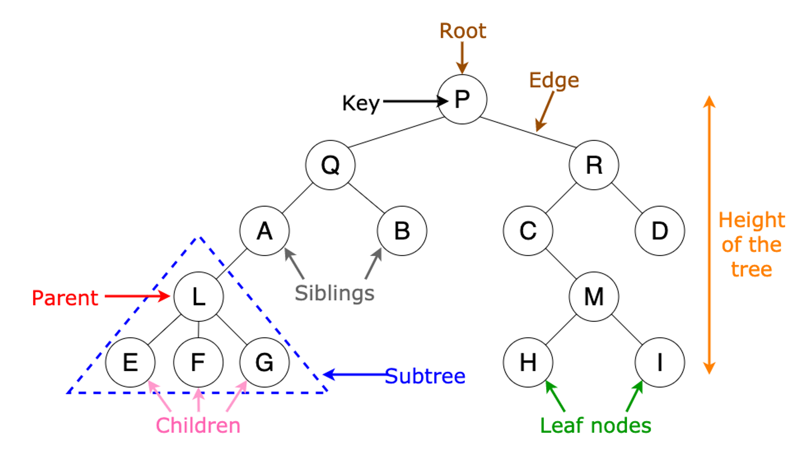

# 트리

그래프와 같이 노드와 노드간을 연결하는 간선으로 구성된 자료구조다. 트리는 특수한 형태의 그래프라고 할 수 있다.

트리는 두 개의 노드 사이에 반드시 1개의 경로만이 존재하며, 사이클이 존재하지 않은 방향 그래프다.

트리구조는 효율적인 탐색을 위해 사용한다.

## 트리의 특징

- 부모-자식 관계가 존재해 레벨이 존재한다.(최상위 노드=Root)
- 노드가 N개이면 간선은 N-1개
- 방향성이 존재하고 사이클은 존재하시 않는다.(비순환)
- 트리의 순회는 전위순회, 중위순회, 후위순회 3가지가 존재한다.

## 용어정리



## 트리의 실사용 예시

컴퓨터의 디렉토리 구조는 대표적인 트리 구조 형태이다. 모든 폴더는 하나의 폴터(루트폴더)에서 시작되어, 가지를 뻗어나가는 모양새를 띈다.

html구조도 대표적인 트리 구조다.

## 트리 메서드

### 추가

서브트리를 직접 삽입하기

value값을 트리에 삽입해 트리 내부에서 서브트리 생성하기

특정 노드를 찾은 뒤[O(n)] 해당 노드의 자식 노드에 삽입

### 탐색

순서가 정해져 있기 않기 때문에 특정 값을 찾기 위해서는 상위 노드부터 하나씩 탐색해야한다.

시간복잡도 O(n)

### 제거

삭제하고자 하는 노드의 부모 노드를 찾은 뒤[O(n)] 삭제하고자 하는 노드를 부모 노드에서 제거

## 예시 실행 결과


```ts
const tree = new TreeNode('1');
const second = new TreeNode('2');
const fourth = new TreeNode('4');
const fifth = new TreeNode('5');
const sixth = new TreeNode('6');
const seventh = new TreeNode('7');
const eightth = new TreeNode('8');
second.addChildren('2-1', '2-2', '2-3');
const third = new TreeNode('3');
third.addChildren('3-1', '3-2', '3-3');
tree.insertSubTree(second, fourth);
fourth.insertSubTree(fifth);
sixth.insertSubTree(seventh);
fifth.insertSubTree(sixth, eightth);
second.insertSubTree(third);
console.log('traverseBFS :>>\n', tree.traverseBFS());
console.log('traverseDFS :>>\n', tree.traverseDFS());
```

```ts
traverseBFS :>>
height:  0 , value:  1
height:  1 , value:  2
height:  1 , value:  4
height:  2 , value:  2-1
height:  2 , value:  2-2
height:  2 , value:  2-3
height:  2 , value:  3
height:  2 , value:  5
height:  3 , value:  3-1
height:  3 , value:  3-2
height:  3 , value:  3-3
height:  3 , value:  6
height:  3 , value:  8
height:  4 , value:  7
```

```ts
traverseDFS :>>
height:  0 , value:  1
height:  1 , value:  2
height:  2 , value:  2-1
height:  2 , value:  2-2
height:  2 , value:  2-3
height:  2 , value:  3
height:  3 , value:  3-1
height:  3 , value:  3-2
height:  3 , value:  3-3
height:  1 , value:  4
height:  2 , value:  5
height:  3 , value:  6
height:  4 , value:  7
height:  3 , value:  8
```

## 참고자료

[https://hanamon.kr/자료구조-tree-트리/](https://hanamon.kr/%EC%9E%90%EB%A3%8C%EA%B5%AC%EC%A1%B0-tree-%ED%8A%B8%EB%A6%AC/)
